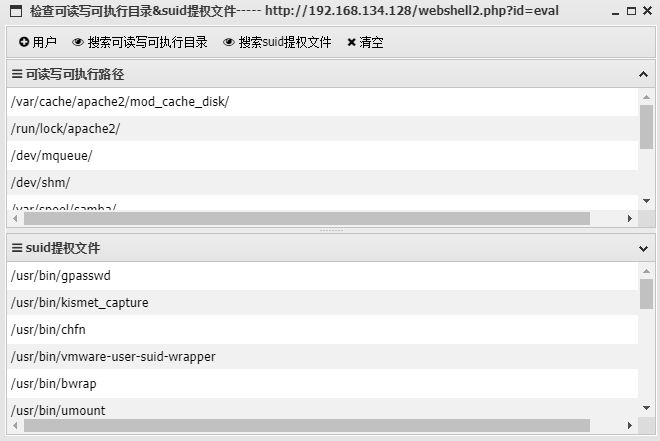

# check_rwx-suid

中国蚁剑（Antsword）插件

在目标服务器上查询可读可写可执行目录以及可用于suid提权的文件（仅限linux）

## 演示

* 信息获取

点击左上角用户按钮，输入想要查找的用户名，得到结果

中间两个搜索按钮分别对应两个结果栏，可以通过关键字查找对应行

最右边的清空按钮可以清空搜索结果栏

## TODO
  增加对windows服务器的支持
  
  增加对asp等脚本类型的支持（有空了就加！哈哈）
 
感谢@caidaome在AntSword下提交的插件建议issue
